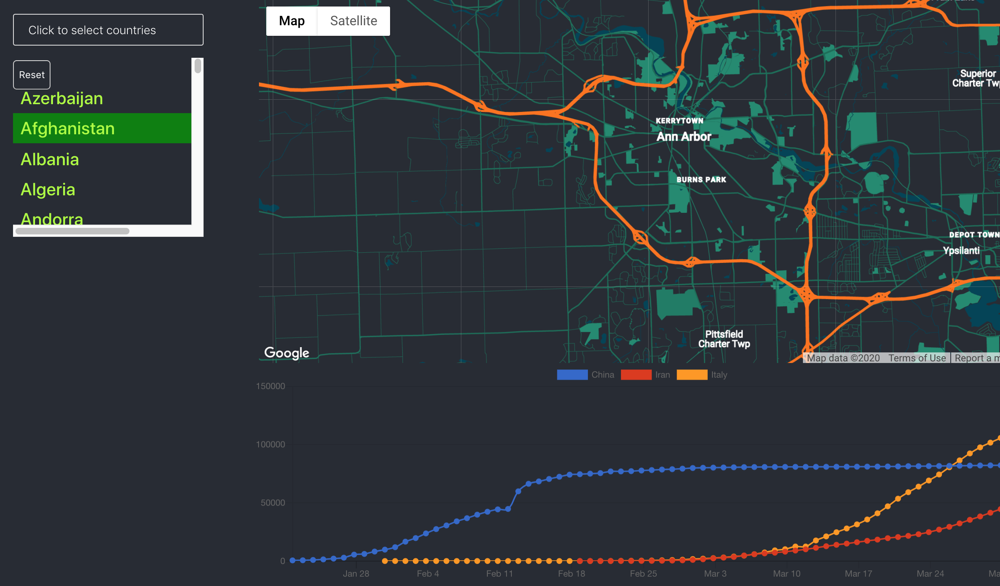

# Covid19 Data Visualization Web App
A React app that displays the latest real-time covid-19 confirmed cases data among different countries.
[click to see](https://master.d1mut6kvig0du1.amplifyapp.com/)

## Available Scripts

To run the app:

### `npm start`

Runs the app in the development mode. 
Open [http://localhost:3000](http://localhost:3000) to view it in the browser.

The page will reload if you make edits. 
You will also see any lint errors in the console.
