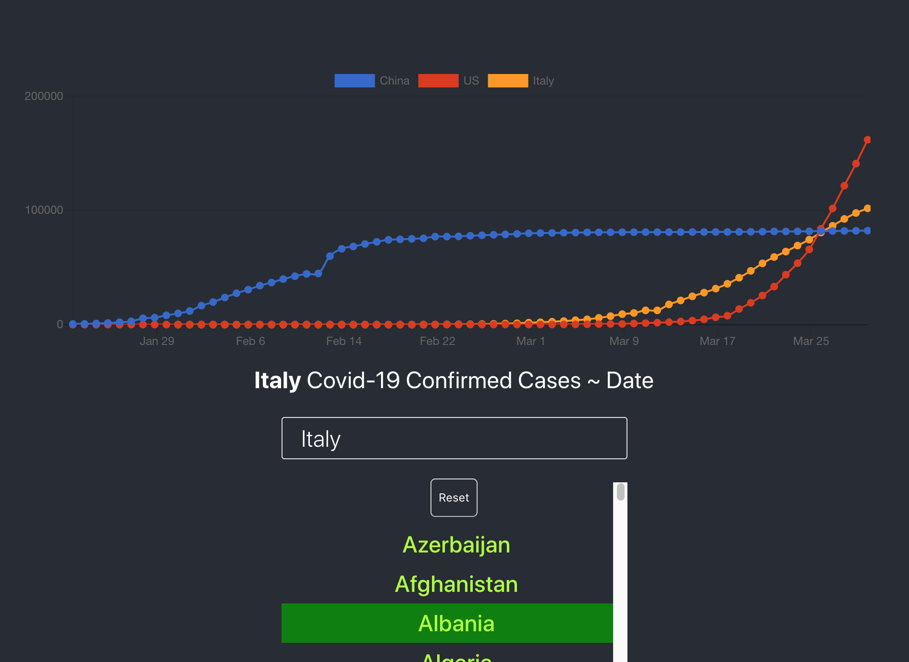

This project was bootstrapped with [Create React App](https://github.com/facebook/create-react-app).

## Available Scripts

In the project directory, you can run:

### `npm start`

Runs the app in the development mode. 
Open [http://localhost:3000](http://localhost:3000) to view it in the browser.

The page will reload if you make edits. 
You will also see any lint errors in the console.

### Code Splitting

This section has moved here: https://facebook.github.io/create-react-app/docs/code-splitting

### Analyzing the Bundle Size

This section has moved here: https://facebook.github.io/create-react-app/docs/analyzing-the-bundle-size

# covid19-realtime-stats
Covid-19 Real-time Stats Update
>>>>>>> 62db72afcc7e62d0c92d926c1da5d7b05d67edad
=======
# covid19-data-visualization
Covid19 Data Visualization
>>>>>>> fd875e80170243dcd51e4d1c35f552e2f4a53952
